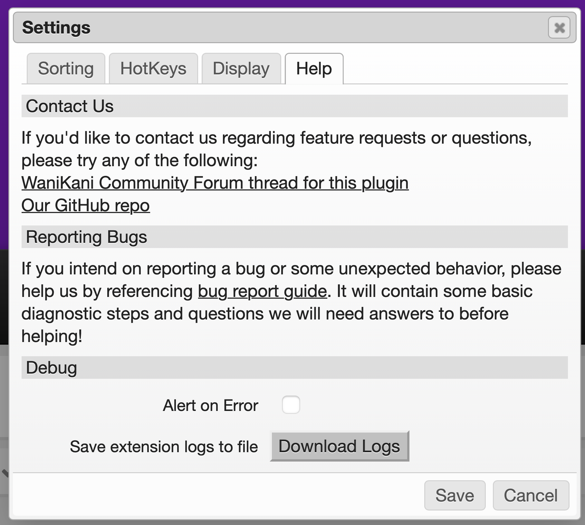

# Reporting Bugs

Detailed below is relevant advice to reference when submitting bug reports for
our userscripts.

## Basic Information

The following is a shortlist of questions that you could answer preemptively:

- What operating system, browser, and userscript engine are you using?
- What exact steps can be taken to reproduce the issue, at least on your
  machine?
- Are you using WaniKani's compatibility mode? (this can be found as `Script
  Compatibility Mode` in [your
  WaniKani settings page](https://www.wanikani.com/settings/app))
- Can you reproduce this bug by running the latest version of the userscript
  with only dependencies activated? (this helps identify if bugs are caused by
  interactions between scripts or instead logical errors in our code)

## Userscript Specifics

Please include a screenshot of your userscript engine's dashboard that displays
the following information for every script running on :

- list of userscripts running on `https://www.wanikani.com`
- versions for every userscript running on `https://www.wanikani.com`
- load order for every userscript running on `https://www.wanikani.com`

Below is a sample screenshot for reference:

## Userscript Logs

The userscripts here are programmed to log helpful information during operation.
Some include the ability to download their logs for the last session. This
information is anonymous and generally just dummy statements meant to help with
tracing execution of code for debugging. If the userscript supports it, these
logs can be downloaded as a single file. Check the settings menu for the script
for a `Help` tab that includes a `Download Logs` button. (example below)

The logs stored are only stored locally and get wiped whenever the reviews page
is closed or reloaded. The log file downloaded should be included with any bug
reports -- especially those that involve the reviews page breaking!

## Javascript Console Logs

While the userscripts here keep their own logs, they do not intercept logs from
the browser or other scripts, not even errors or warning messages. Because of
this, any interactions between multiple userscripts or between a single
userscript and the browser or engine cannot be captured in [downloaded
logs](#userscript-logs).

If possible, it is helpful to include a screenshot or text-copy of any entries
in your Javascript console that are present when a bug occurs. This is
incredibly important information if reporting bugs that may involve multiple
userscripts or browser issues.

If you do not know how to access the Javascript console for your browser, please
reference [this StackOverflow
response](https://webmasters.stackexchange.com/a/77337).

## Where to Report

If you have a GitHub user account and would like to submit a bug report to our
repo's issues, please feel free to do so, including the above information.

Alternatively, most users may already have a WaniKani community forum account.
For these users, we can recommend replying to [the forum thread for this
plugin](https://community.wanikani.com/t/userscript-reorder-buttons/41133) with
the above information instead. **But**, if you've already made a reply to the
thread with your bug report and _afterwards_ find this guide, please feel free
to instead edit your reply instead after adding all the new information.
