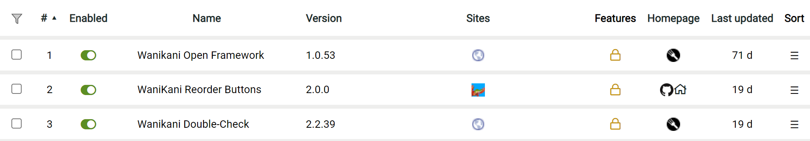

# Reporting Bugs

Detailed below is relevant advice to reference when submitting bug reports for
our userscripts.

## Basic Information

The following is a shortlist of questions that you could answer preemptively:

- What operating system, browser, and userscript engine are you using?
- What exact steps can be taken to reproduce the issue, at least on your
  machine?
- Are you using WaniKani's compatibility mode? (this can be found as `Script
  Compatibility Mode` in [your
  WaniKani settings page](https://www.wanikani.com/settings/app))
- Can you reproduce this bug by running the latest version of the userscript
  with only dependencies activated? (this helps identify if bugs are caused by
  interactions between scripts or instead logical errors in our code)

## Userscript Specifics

Please include a screenshot of your userscript engine's dashboard that displays
the following information for every script running on :

- list of userscripts running on `https://www.wanikani.com`
- versions for every userscript running on `https://www.wanikani.com`
- load order for every userscript running on `https://www.wanikani.com`

Below is a sample screenshot for reference:

## Javascript Console Logs

The userscripts here are programmed to log helpful information during operation.
This information is anonymous and generally just dummy statements meant to help
with tracing execution of code for debugging.

This output can be found in your browser's Javascript console after the script
has been started. It may be helpful to include logs along with your bug report
in the form of a copy-pasted block of formatted text or as a screenshot of the
entries if they are short enough.

If you do not know how to access the Javascript console for your browser, please
reference [this StackOverflow
response](https://webmasters.stackexchange.com/a/77337).

## Where to Report

If you have a GitHub user account and would like to submit a bug report to our
repo's issues, please feel free to do so, including the above information.

Alternatively, most users may already have a WaniKani community forum account.
For these users, we can recommend replying to [the forum thread for this
plugin](https://community.wanikani.com/t/userscript-reorder-buttons/41133) with
the above information instead. **But**, if you've already made a reply to the
thread with your bug report and _afterwards_ find this guide, please feel free
to instead edit your reply instead after adding all the new information.
