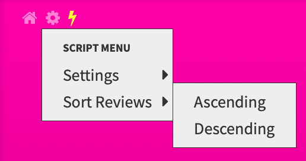

# WaniKani Reorder Buttons

_Enables reordering of WaniKani review queue items by their SRS levels_

This script started is a modified copy of Towe's
[WaniKani SRS Reorder Button](https://greasyfork.org/en/scripts/29673-wanikani-srs-reorder-button).
Their original WaniKani community post can be found
[here](https://community.wanikani.com/t/wanikani-srs-reorder-button/17880). Most
of the credit for this script goes to them! Major thanks as well to rfindley and
BIsTheAnswer for their help in the forums, as well as rfindley's publishing of
the [WaniKani Open
Framework](https://github.com/rfindley/wanikani-open-framework)!

## Overview

This script will add two buttons inside a context menu on the top right of your
reviews page.

The ordering can be either ascending or descending, though this plugin can be
configured to automatically sort items in ascending order at start up. It is
also possible to to make review items have their meaning and readings be asked
in immediate succession as well.

There is also an indicator added to the top of the page indicating the amount of
remaining reviews for each SRS level. These will update as you answer your
review questions.

## Persistent Settings

Leveraging the WaniKani Open Framework, this script integrates into the common
menu panel like other scripts. A new menu item will be installed that opens the
following settings panel for this plugin:

From here you can customize hotkeys and sorting behavior in a persistent manner.

## HotKeys

There are two hotkeys registered by default for this script:

- `Alt` + `Shift` + `-`: reorder review items by SRS level in descending order
- `Alt` + `Shift` + `=`: reorder review items by SRS level in ascending order

These are entirely customizable and toggleable within the
[settings](#persistent-settings) panel!

# Install

Before installing this script, you'll need both a UserScript engine as well as
the WaniKani Open Framework user ([click here to install
it](https://greasyfork.org/en/scripts/38582-wanikani-open-framework)) script
pre-installed.

Once those prerequisites are met, you can click
[here](https://github.com/loksonarius/wanikani-userscripts/raw/master/wanikani-reorder-buttons/script.js)
to have your UserScript engine prompt you for installation. This has been tested
to work with the [Tampermonkey](https://tampermonkey.net) userscript engine.

[:heart:](https://github.com/loksonarius/wanikani-userscripts)
