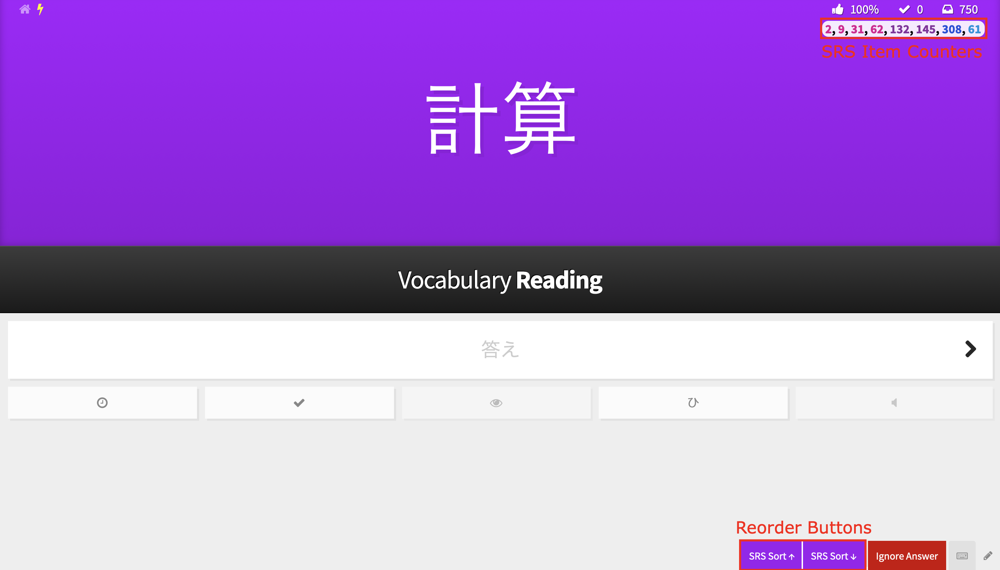

# WaniKani Reorder Buttons

_Enables reordering of WaniKani review queue items by their SRS levels_

This script started is a modified copy of Towe's
[WaniKani SRS Reorder Button](https://greasyfork.org/en/scripts/29673-wanikani-srs-reorder-button).
Their original WaniKani community post can be found
[here](https://community.wanikani.com/t/wanikani-srs-reorder-button/17880). Most
of the credit for this script goes to them, and serious thanks for publishing it
too!

## Overview

This script will add two buttons to the bottom of the WaniKani review page that
will reorder your remaining reviews by their SRS order.

The ordering can be either ascending or descending, though on start-up, items
will be reordered in ascending order. Review items will also have their meaning
and readings be asked in immediate succession.

There is also an indicator added to the top of the page indicating the amount of
remaining reviews for each SRS level.

## HotKeys

There are two hotkeys registered for this script:

- `Alt` + `Shift` + `-`: reorder review items by SRS level in descending order
- `Alt` + `Shift` + `=`: reorder review items by SRS level in ascending order

# Install

Click
[here](https://github.com/loksonarius/wanikani-userscripts/raw/master/wanikani-reorder-buttons/script.user.js)
to have your UserScript engine prompt you for installation. This has been tested
to work with the [Tampermonkey](https://tampermonkey.net) userscript engine.

[:heart:](https://github.com/loksonarius/wanikani-userscripts)
