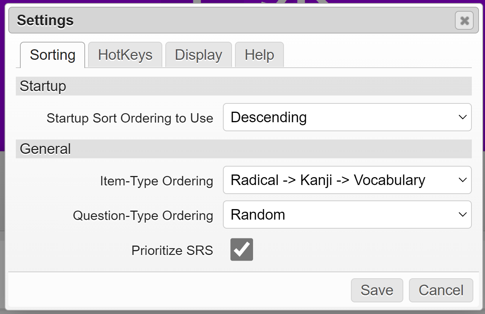

# WaniKani Reorder Buttons

_Enables reordering of WaniKani review queue items by their SRS levels_

This script started is a modified copy of Towe's
[WaniKani SRS Reorder Button](https://greasyfork.org/en/scripts/29673-wanikani-srs-reorder-button).
Their original WaniKani community post can be found
[here](https://community.wanikani.com/t/wanikani-srs-reorder-button/17880). Most
of the credit for this script goes to them! Major thanks as well to rfindley and
BIsTheAnswer for their help in the forums, as well as rfindley's publishing of
the [WaniKani Open
Framework](https://github.com/rfindley/wanikani-open-framework)!

## Features

### The Main Thing

This script will add a sorting button to the top-left corner of the reviews
page. The button will allow you to sort reviews in either ascending, descending,
or a randomized order. The button's icon will update accordingly to indicate the
current sorting mode as well.

### Review Counters

There is also an indicator added to the top of the page indicating the amount of
remaining reviews for each SRS level. These will update as you answer your
review questions. If you'd rather omit the counters entirely, it is possible to
remove them from the UI by configuring it in the [settings
panel](#persistent-settings).

### HotKeys

There are two hotkeys registered by default for this script:

- `Alt` + `Shift` + `-`: reorder review items by SRS level in descending order
- `Alt` + `Shift` + `=`: reorder review items by SRS level in ascending order

These are entirely customizable and toggleable within the
[settings](#persistent-settings) panel!

### CogWheel Menu Integration

Thanks to the WaniKani Open Framework, this script integrates into the common
menu panel like other scripts. Two new menu entries will be registered to
trigger specific sorting functions on-demand:

These buttons can be used if neither [hotkeys](#hotkeys) nor the [one-click
button](#the-main-thing) are available.

### Persistent Settings

Leveraging the WaniKani Open Framework, this script integrates into the common
menu panel like other scripts. A new menu item will be installed that opens the
following settings panel for this plugin:

From here you can customize hotkeys and sorting behavior in a persistent manner.

#### Auto-Sort on Startup

If every time you start reviews, you'd like them to be automatically sorted,
this is possible by configuring it with a single checkbox. The default sorting
on startup will be ascending, prioritizing new review items.

This setting can be found under the `Sorting` section of the settings panel.

#### Hiding the Sort Button

It is possible to hide the sorting button from the UI entirely. This will
not remove the sort buttons in the cog menu, nor will it disable the use of
[hotkeys](#hotkeys) either.

This setting can be found under the `Display` section of the settings panel.

#### 1x1 Mode

When sorting reviews, it is possible to force 1x1 mode. In 1x1 mode, review
items will be grouped such that meaning and reading question types will appear
in immediate succession.

:warning: _it should be noted that the way this is implemented may cause issues
with other scripts on the page that rely on a functioning `Math.Random`
function being available_ :warning:

This setting can be found under the `Sorting` section of the settings panel.

## Install

Before installing this script, you'll need both a UserScript engine as well as
the WaniKani Open Framework user ([click here to install
it](https://greasyfork.org/en/scripts/38582-wanikani-open-framework)) script
pre-installed.

Once those prerequisites are met, you can click
[here](https://github.com/loksonarius/wanikani-userscripts/raw/master/wanikani-reorder-buttons/script.js)
to have your UserScript engine prompt you for installation. This has been tested
to work with the [Tampermonkey](https://tampermonkey.net) userscript engine.

[:heart:](https://github.com/loksonarius/wanikani-userscripts)
