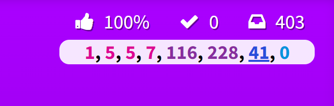
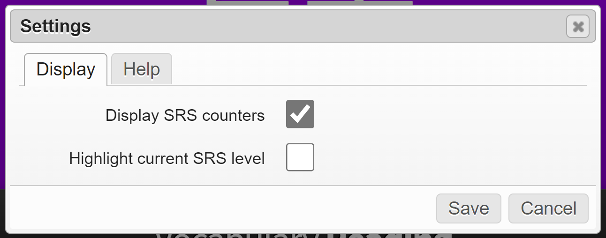

# WaniKani SRS Counters

_Track the number of review items left for each SRS level_

This script is an independent implementation of the SRS counter originally a
part of the [Reorder Buttons userscript](../wanikani-reorder-buttons). By
isolating this feature, users can have the counter without having to install a
review-ordering solution that they don't need. Hopefully, it also enables
greater compatibility with other userscripts that might otherwise conflict with
portions of Reorder Buttons. Major thanks to rfindley for their work maintaining
the [WaniKani Open
Framework](https://github.com/rfindley/wanikani-open-framework)!

## Features

### The Main Thing

This script adds a cheeky little counter to the top-right section of the screen
during reviews indicating the amount of remaining reviews for each SRS level.
These will update as you answer your review questions. If you'd rather omit the
counters entirely, it is possible to remove them from the UI by configuring it
in the [settings panel](#persistent-settings).

The level counters are color-coded to match their level color in WaniKani's UI:

-  Apprentice
-  Guru
-  Master
-  Enlightened

### Persistent Settings

Leveraging the WaniKani Open Framework, this script integrates into the common
menu panel like other scripts. A new menu item will be installed that opens the
following settings panel for this plugin:

From here you can enable or disable the review counters.

## Install

Before installing this script, you'll need both a UserScript engine as well as
the WaniKani Open Framework user ([click here to install
it](https://greasyfork.org/en/scripts/38582-wanikani-open-framework)) script
pre-installed.

Once those prerequisites are met, you can click
[here](https://github.com/loksonarius/wanikani-userscripts/raw/master/wanikani-srs-counters/script.user.js)
to have your UserScript engine prompt you for installation. This has been tested
to work with the [Tampermonkey](https://tampermonkey.net) userscript engine.

[:heart:](https://github.com/loksonarius/wanikani-userscripts)
